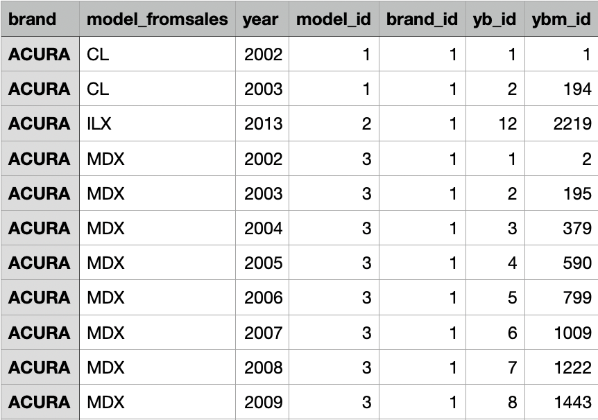
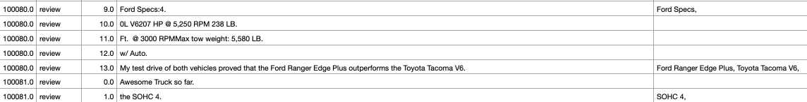
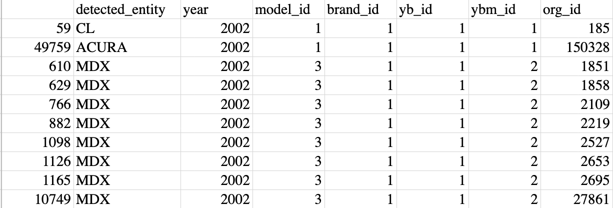
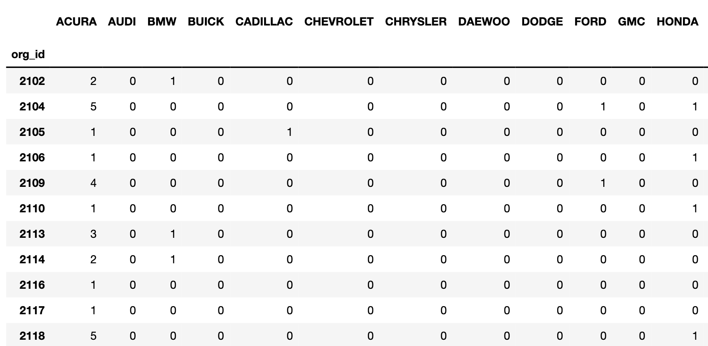
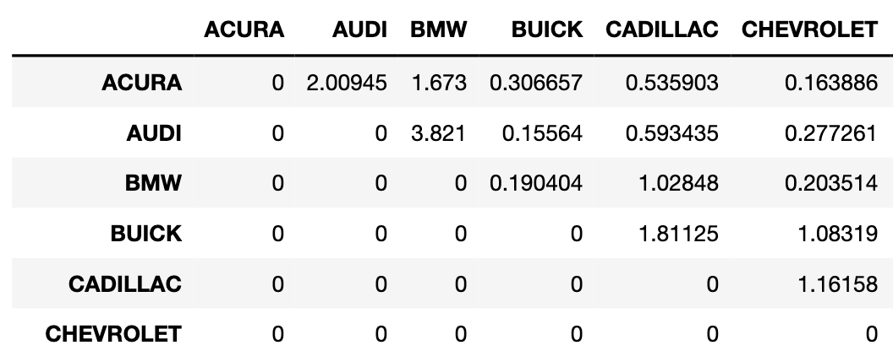
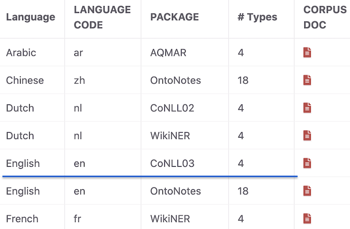

<h1 align="center">Market_Analysis_On_Customer_Reviews</h1>

## About 

The purpose of this project is to analyze how consumers perceive the quality of complex products for which they lack the expertise to accurately access. This stream of work sits at the intersection between operations management and marketing. The research will use aggregate customer review measures as a proxy for product quality to investigate how relative perceived quality amongst similar products influences market shares in a competitive market.
By understanding how consumers evaluate quality of complex, technology products, firms can design products that better communicate the benefits of a new technology and allocate their resources accordingly.

## Design
The code is to read through the dataset of car customer reviews, and filter out information such as possible car brand names, model names, and production year. We match the mentioned car models with a set of car brands/models, in order to generate a dataset of all the mentioned car brand names, model names, and year of production in the reviews. 

The dataset we can be downloaded from https://www.dropbox.com/s/gb3i3deyb7swvvx/df_test_conf_lv.csv?dl=1, each line contains the information of one review sentence. 

The code first use the python NLP package [stanza](https://stanfordnlp.github.io/stanza/) to perform a Named Entity Recognition on the entire dataset, and generate a list of detected possible car brand/model names for each review sentence.

We compare the detected possible car brand/model names with the car brand/model names in a reference set of car information, as shown below: 

Then we create a dataframe containing all the detected entities that can be matched with car brand/models in the reference set, which is all the mentioned car brand/models in the each review text. 

### Procedures

1. Load the dataframe of all review texts, and create an empty column named "Entities" for detected possible car brand/model names in later steps using [data_cleaning.py](https://github.com/ScarlettHuang1/Analysis_On_Customer_Reviews-/blob/main/data_cleaning.py), and save the new dataframe as "[entire_dataset_cleaned.csv](https://drive.google.com/file/d/1VYtQre2tm-sig38A1vDPSlrABat42-GS/view?usp=sharing)".

2. Load the entire_data_cleaned file. Use the NLP package [stanza](https://stanfordnlp.github.io/stanza/) to read the reviews line by line and detect entities that are possibly car brand or model names using [data_tagging.py](https://github.com/ScarlettHuang1/Analysis_On_Customer_Reviews-/blob/main/data_tagging.py). Put the detected entities in each review sentence to the column "Entities" that we created in step 1. Because the dataset has more than 760,000 reivew sentences, we write back to the dataframe every 400 lines to save the changes incase the task times out before we process all the sentences. If the task times out before all sentences are tagged, we re-start the processe by reading the latest dataframe that is generated, and the code restart processing the reviews from the first sentence that has not been processed. Save the tagged data to "[entire_dataset_tagged.csv](https://drive.google.com/file/d/1JMCRlcNrF-Hzg9-vz-IFVcgWuVzE4ykg/view?usp=sharing)". The result would look like below:

3. Based on the [reference car information]("https://www.dropbox.com/s/sxf35ebm71n3ho7/car%20model%20identifier.csv?dl=1"), check if each detected entity can be matched to any car brand/model names using [data_identifying_regular](https://github.com/ScarlettHuang1/Analysis_On_Customer_Reviews-/blob/main/data_identifying_regular.py) (for regular model names) and [data_identifying_irregular](https://github.com/ScarlettHuang1/Analysis_On_Customer_Reviews-/blob/main/data_identifying_irregular.py) (for irregular model names containing a space, slash, or dash): 

- After reading "[entire_dataset_tagged.csv](https://drive.google.com/file/d/1JMCRlcNrF-Hzg9-vz-IFVcgWuVzE4ykg/view?usp=sharing)", convert the contents in ['Entities'] from string to list because csv is a delimited text file, and we need to read the detected entities as a list.

    #### in data_identifying_regular.py, we apply the following rules:
- If the identified entity can be matched with a brand name (whether it is regular or not, since the only irregular brand name are MERCEDES-BENZ and LAND ROVER) in the [reference dataframe]("https://www.dropbox.com/s/sxf35ebm71n3ho7/car%20model%20identifier.csv?dl=1"), save the detected entity into a new dataframd, and assign the brand_id to it.
- For all the possible model names with this brand name, check if any of them is contained in the current review sentence. If yes, assign the model_id to the entity, if not, set its model_id to "". 
- If the detected entity is itself a model name, we check if this model name is a unique one. If it is unique, we also save the entity to the new dataframe and assign the brand_id and model_id to this entity, otherwise we disregard it. 
- For all the possible years of the brand, if the year is contained in the current review sentence, assign the year and the yb_id to the entity, if not, set the year and yb_id to "".
- Until now, if we have the brand_id, model_id, and year of an entity, assign the ybm_ID to it, otherwise set its ybm_ID to "".
- Notice that we only perform the iteration above if the identified entity is itself matched to a brand name or is a unique model name (an identified model name or year with missing brand should not exist).

    #### in data_identifying_irregular.py, apply the following rules:
- If the detected entity can be matched with an irregular model name with a space or a dash in the [reference dataframe]("https://www.dropbox.com/s/sxf35ebm71n3ho7/car%20model%20identifier.csv?dl=1"), such as "GRAND CHEROKEE" (as GRAND-CHEROKEE, GRAND, CHEROKEE, or GRAND_CHEROKEE) and "CR-V" (as CR, V, CRV, CR_V, CR V) assign the model_id to it without saving it to the dataframe. 
- If the detected entity can be matched with either the first or the second model name divided by a slash in the [reference dataframe]("https://www.dropbox.com/s/sxf35ebm71n3ho7/car%20model%20identifier.csv?dl=1"), such as "G35/37" (as G35 or G37), assign the model_id to it. If the model is a unique model, directly save it to the new dataframe and assign the brand_id and model_id to it and skip the next two steps, otherwise just assign the model_id to it without saving it to the dataframe. **(Here it is different from the irregular model names with spaces and dashes, because if a model name separated by a slash such as "G35/37" is unique, then the detected entity which can be matched to this model name (either G35 or G37) is a unique model name, so it's okay to save it and assign the brand_id. While in the case of space or dash, even if a model name with space such as "RAM PICKUP" is a unique model name, a detected entity that can be matched to it, like "RAM", may not be a unique model name, so we still need to check if the brand name is mentioned in the sentence.)**

- For the brand name that associated with the model name, if this brand name is contained by the review texts, assign the brand_id to this entity, otherwise set the brand_id to "".

- We don't allow any identification without the brand_id, so we save an entity to a new dataframe only if its brand_id is not "". Apply the following rules to such entities:

- If the year associated with that brand name is in the review text, assign the year and the yb_id to the entity, else set the year and yb_id to "". 

- Until now if we have the brand_id, model_id, and year, assign the ybm_id to the entity, otherwise assign the ybm_id to "".

Merge the identified regular and irregular car brand/model names using [data_merging](https://github.com/ScarlettHuang1/Analysis_On_Customer_Reviews-/blob/main/data_merging.py), drop duplicates, and save the information to a new datafram named "[entire_dataset_mentioned](https://drive.google.com/file/d/1vTykWcz3TLOzHUCXLnXRyKHdpf7aKpvK/view?usp=sharing)". The result would look like below: 

4. We now count how many times a pair of brand/model names are mentioned together in a single review using [lift_calculating](https://github.com/ScarlettHuang1/Analysis_On_Customer_Reviews-/blob/main/lift_calculating/lift_calculating.ipynb). In this file, we try to capture how often is a pair of brand names (respectfully model names) are co-mentioned. 
-- We first create a squared matrix containing all the brand names(respectfully model names) as its row and column names. Each cell of the matrix is an integer (intiated as zero) representing the times that the two brand(model) names are detected in that review. We then concact this matrix to the entire_dataset_mentioned in the last step. We also add another column to this matrix called "cur_brand_id"("cur_model_id") to represent which brand(model) is this review for. 
-- Then we loop through all rows of the entire dataframe. For each sentence(each line), if an entity is detected in it, we add 1 to the cell representing this brand. We also add 1 to the cell that representing the current brand which the review is for. Then group the dataframe by review ID(org_id) and drop the unnecessary information. The resulted matrix then tells us in each review, how many times a brand name(model name) is mentioned. 

-- We then Now we define a function using dictionary to calculate the lift between any pair of brand names(model names). In each row, if the count value for any two brand names (model names) are both not zero, we add (brand1, brand2) = 1 to the dictionary, meaning that we captured the information that this pair (brand1, brand2) is co-mentioned once (if a pair of brand names (model names) are actually co-mentioned multiple times within a single review, we only count it once, because if a person compares a pair of brands(models) in one review, the times that he co-mentiones the brand names(model names) in that review are not siginificant). 

-- Before we pass the matrix to the dictionary function, we replace all the values larger than 1 with 1 (for the reason discussed in the previous step). Now the function "lift_calculator" would tell us how often are two names mentioned together in the entire review dataset. We rely on the lift of the brand names (lift is calculated by (the times that brand1 and brand2 are mentioned together)/(the times that brand1 is mentioned * the times that brand2 is mentioned) to represent the proximity of a pair of brand names.  

### Required Packages and Resources

The dataframe containing reviews and information: https://www.dropbox.com/s/gb3i3deyb7swvvx/df_test_conf_lv.csv?dl=1

Packages used: nltk, pandas, numpy, re, and [stanza](https://stanfordnlp.github.io/stanza/)  - We use the package with [4 named entity types](https://stanfordnlp.github.io/stanza/available_models.html) (language code = en, package = conll03), and supported types include PER (Person), LOC (Location), ORG (Organization) and MISC (Miscellaneous): 

  
The results were generated with the help of [Vanderbilt ACCRE Cluster Virtual Machine](https://www.vanderbilt.edu/accre/documentation/python/#installing-additional-packages-with-virtual-environments). 

## Conclusion
Now we could use the result dataset to exam how many times a specific car model is mentioned. We will also determine how frequently two models are mentioned together. The lift between two brands/models may indicate their similarity or association as perceived by consumers.
